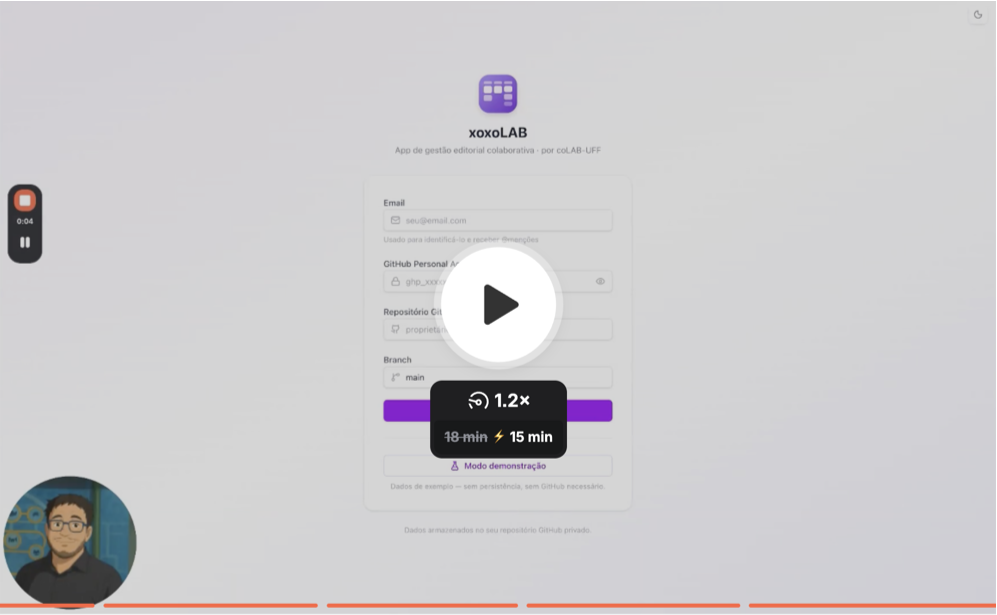

# :pencil2: xoxoLAB

[](https://doi.org/10.5281/zenodo.19434066)

O xoxoLAB é uma ferramenta web de gestão editorial colaborativa que reúne em uma única interface nove instrumentos de trabalho para equipes de comunicação e mídias sociais: quadro de avisos, pautas, conteúdos, kanban, efemérides, políticas, recursos, equipe e senhas, todos conectados por um sistema de @menções que notifica colaboradores em tempo real. Os dados são armazenados diretamente no repositório GitHub privado da própria equipe, sem servidor intermediário, e múltiplos projetos podem ser gerenciados simultaneamente por diferentes grupos de colaboradores, cada um com seu próprio espaço isolado de trabalho.

O software foi desenvolvido por [Viktor Chagas](https://scholar.google.com/citations?user=F02DKoAAAAAJ&hl=en) e pelo [coLAB/UFF](http://colab-uff.github.io), com auxílio do Claude Code Sonnet 4.6 para as tarefas de programação. Os autores agradecem a Rafael Cardoso Sampaio pelos comentários e sugestões de adoção de ferramentas de IA, que levaram ao planejamento inicial da aplicação.

---

# :octocat: Frameworks

O xoxoLAB é desenvolvido em TypeScript com React 19 como framework de interface, utilizando Vite 7 como bundler e servidor de desenvolvimento. A estilização é feita com Tailwind CSS v4 via plugin oficial para Vite, e os componentes de interface são construídos diretamente sobre primitivos Radix UI com utilitários cva, clsx e tailwind-merge. O roteamento é feito com React Router v7 com rotas aninhadas por projeto, e o gerenciamento de dados assíncronos é feito com TanStack Query v5. Recursos adicionais incluem @hello-pangea/dnd para drag-and-drop em pautas e kanban, date-fns para manipulação de datas, react-markdown com remark-gfm para renderização de Markdown, jsPDF e jspdf-autotable para exportação em PDF, html2canvas para exportação em PNG, xlsx para planilhas, docx para documentos Word e js-yaml para serialização dos dados, além de @emailjs/browser para notificações opcionais por e-mail.

Toda a persistência de dados ocorre diretamente em um repositório GitHub privado da equipe por meio da GitHub Contents API (REST), sem banco de dados externo. Os dados são armazenados em arquivos YAML organizados por projeto e por módulo no repositório. O projeto não depende de nenhum serviço de backend próprio — o navegador se comunica diretamente com a API do GitHub, e cada colaborador autentica-se com seu próprio Personal Access Token.

---

## :clapper: Tutorial

<a href="https://www.loom.com/share/287300e4c8a34d969248bb3a1f91b4cb"></a>

## :gem: Módulos

### 1. Gestão de Projetos

O xoxoLAB permite gerenciar várias contas e projetos simultaneamente. Assim, equipes de produção de conteúdo para as mídias sociais podem gerenciar várias páginas e perfis em um único ambiente. Ao efetuar o login no software, é preciso indicar um email, que funcionará como nome de usuário. As equipes podem atribuir tarefas e notificar usuários por meio de um sistema de menções (@). Disponível também em **modo demonstração**, sem necessidade de conta GitHub.


#### Como usar

1. Acesse a aplicação
2. Informe seu **email** e as demais credenciais de acesso (ou use o Modo demonstração)
3. Crie ou acesse um projeto e convide colaboradores pelos seus emails

Os dados ficam inteiramente no seu repositório GitHub privado.


### 2. Quadro de Avisos

Um quadro de recados colaborativo organizado como uma Matriz Eisenhower, para priorização de comunicados internos da equipe.


- **4 Quadrantes** organizados por eixos de Iminência (horizontal) e Empenho (vertical): Crítico, Estrutural, Operacional, Residual
- Cards com título, descrição em Markdown, prioridade, suporte a @menções
- Clique no marcador colorido arquiva o card na área "Concluídos" (colapsável)
- **Export**: PNG, PDF (paisagem), Excel, Markdown


### 3. Pautas

Lista de ideias editoriais organizada por seções temáticas, com suporte a drag-and-drop. As pautas funcionam como propostas a serem avaliadas pela equipe editorial. É possível organizar as pautas em diferentes seções e atribuir tags a elas, a fim de organizar suas ideias. Caso entrem em produção, as pautas podem ser encaminhadas diretamente para o módulo Conteúdos com um único clique.


- Seções customizáveis (criar, reordenar, excluir)
- Itens com título, corpo em Markdown, tags coloridas, data, responsável e @menções
- Reordenação de itens por DnD dentro e entre seções
- Quick-add por Enter direto na lista
- Botão **"Encaminhar para Conteúdos"** (ícone →) em cada item envia a pauta ao módulo Conteúdos
- **Export**: PDF, Excel, CSV, Markdown


### 4. Conteúdos

Visão geral de todos os conteúdos em produção. O módulo Conteúdos é um controle geral de fluxo de produção, em que o editor ou a editora têm um panorama sobre em que pautas a equipe está trabalhando no momento. A tabela de Conteúdos apresenta cada item em seu respectivo estágio de produção. Em formato que se assemelha a apps de roadmap ou bug tracker para desenvolvedores, o módulo recebe as ideias encaminhadas do módulo Pautas e envia itens concluídos automaticamente para o Kanban.


- **Tabela editável inline** com as colunas: Descrição, Atribuição, Prazo, Tipo, Importância, Dependência, Progresso, Criado em
- **Atribuição e Dependência**: seletor com autocompletar por @, exibe avatar colorido + nome do colaborador; dispara notificação por e-mail ao usuário marcado
- **Tipos customizáveis**: o usuário define sua própria lista de tipos de conteúdo (Artigo, Resenha etc.) via "Gerenciar Tipos"
- **Importância**: pílulas Urgente · Alta · Média · Baixa
- **Progresso**: seletor cíclico clicável — Aguardando na Fila → Em Produção → Em Revisão → Aguardando Aprovação → Atrasado → Pronto
- Ao marcar como **Pronto**, o item migra automaticamente para o Kanban (coluna Planejamento) e vai ao final da lista (ocultável); reverter o status remove o card do Kanban
- Ordenação por qualquer coluna; padrão por data de criação


### 5. Kanban

Quadro de gestão de conteúdo por etapas com timeline visual. Após a produção do conteúdo, o Kanban funciona para gerenciar a divulgação em plataformas digitais de mídias sociais. Organizado em cinco colunas (Planejamento, Criação, Revisão/Aprovação, Agendamento e Publicação), o módulo recebe os conteúdos produzidos e planeja sua divulgação nas redes, permitindo atribuição de funções a membros da equipe, agendamento para publicação futura, e sincronização com Efemérides importantes através do controle da linha do tempo.


- **5 colunas**: Planejamento · Criação · Revisão/Aprovação · Agendamento · Publicação (oculta por padrão)
- Cards com: título, descrição Markdown, plataformas de publicação, responsável, revisor, previsão de publicação e data de agendamento
- **Pendências automáticas**: pílula PENDENTE em Agendamento sem data; pílula PENDENTE em Revisão/Aprovação sem revisor
- **Agendamento automático**: quando a data de agendamento é atingida, o card migra para Publicação; arrastar de Publicação de volta apaga a data de agendamento
- Cards com imagens/vídeos anexados via drag-and-drop ou botão de upload; thumbnails exibidos no card e na interface de edição
- Log de auditoria por card (ações timestampadas: criação, movimentação, atribuição, edição)
- **Download individual de card**: Markdown, DOCX ou ZIP (inclui mídia anexada); exporta apenas título e texto
- **Timeline** acima do quadro: chips coloridos por plataforma, zoom in/out, sincronizada com a largura do board
- **Export**: PNG/PDF/Excel/CSV/Markdown do board


### 6. Efemérides

Calendário de eventos importantes, datas comemorativas e lembretes. Importa arquivos ICS ou sincroniza diretamente com o Google Calendar.


- Grid mensal React puro (sem biblioteca de calendário externa), navegação por meses
- Eventos manuais com recorrência: anual, mensal, semanal, sem recorrência
- **Eventos sintéticos** (faded, não editáveis): cards de Kanban com prazo aparecem automaticamente no calendário
- Lembretes automáticos por e-mail (EmailJS) com 7 e 1 dia de antecedência
- **Import ICS**: importação em lote com deduplicação automática e desfazer por lote; "Limpar tudo" com confirmação
- **Google Calendar**: conexão via OAuth 2.0, token persistido em localStorage com renovação silenciosa
- **Export**: `.ics`, Markdown


### 7. Políticas

Wiki editorial da equipe com documentos de políticas de gestão de conteúdos, manual de redação, entre outros.


- Lista de documentos com título e corpo em Markdown (editor com preview)
- Criação, edição e exclusão de políticas
- **Export por documento**: Markdown, DOCX, PDF
- **Exportar Tudo**: gera PDF, DOCX ou Markdown com todos os documentos concatenados


### 8. Recursos

Central de links úteis, documentação e arquivos de template. Armazene aqui logomarcas, arquivos vetoriais de ilustrações, e mais.


- **Aba Links**: lista de recursos externos com título, URL, descrição e categoria; auto-fetch do título da página
- **Aba Templates**: upload de arquivos para o repositório GitHub (`recursos/templates/`); download autenticado via GitHub API; aviso para arquivos >50MB
- Ordenação e organização por categorias


### 9. Equipe

Visão consolidada das atribuições e menções por colaborador. Exibe também tarefas atribuídas via Conteúdos.


- Lista todos os membros do projeto (cadastrados no `meta.yaml`)
- Para cada membro: avatar com iniciais colorido, lista de @menções em Avisos/Pautas/Kanban/Políticas, atribuições no Kanban e dependências em Conteúdos
- Calculado em runtime via `useMemo` (sem storage próprio)


### 10. Senhas

Cofre de credenciais armazenadas no repositório GitHub privado.


- Tabela com linhas expansíveis (serviço pai + múltiplas contas filho)
- Colunas: plataforma, serviço, URL, login, senha (oculta por padrão com toggle), notas
- Suporte a plataformas customizadas ("Outra…") com campo de texto livre
- Adição e edição inline ou via dialog
- Armazenado em `senhas/senhas.yaml` no repositório privado da equipe
- **Sem exportação** (por segurança)

---

# 🚀 Instalação do pqLAB — Passo a passo

## Estrutura de Dados no GitHub

```
projects/
  {project-id}/
    meta.yaml               # name, createdBy, users: [email...]
    avisos/{card-id}.yaml
    pautas/pautas.yaml      # { sections, items, tags }
    conteudos/conteudos.yaml # { items, types }
    kanban/{card-id}.yaml
    efemerides/eventos.yaml
    politicas/{policy-id}.yaml
    recursos/recursos.yaml
    recursos/templates/{file}
    senhas/senhas.yaml
users/
  index.yaml               # emails registrados (autocomplete de @menções)
```

---

## Instalação

### Opção 1 — Deploy próprio via Fork (recomendado)

Hospede sua própria instância no GitHub Pages em menos de 5 minutos.

#### PASSO 1. Fork do repositório

Acesse [github.com/ombudsmanviktor/xoxolab](https://github.com/ombudsmanviktor/xoxolab) e clique em **Fork**.

#### PASSO 2. Habilitar GitHub Actions no fork

- Acesse *Settings → Actions → General*
- Selecione **Allow all actions and reusable workflows**
- Clique em **Save**

#### PASSO 3. Configurar GitHub Pages

- Acesse *Settings → Pages*
- Em *Source*, selecione **GitHub Actions**
- Clique em **Save**

#### PASSO 4. Disparar o primeiro deploy

- Acesse *Actions → Deploy to GitHub Pages*
- Clique em **Run workflow → Run workflow**

#### PASSO 5. Aguardar (~2 minutos)

A aplicação estará disponível em:

```
https://SEU_USUARIO.github.io/xoxolab/
```

#### PASSO 6. Domínio customizado (opcional)

1. Edite `public/CNAME` com o seu domínio
2. Configure o DNS apontando para `SEU_USUARIO.github.io`
3. Em *Settings → Pages*, informe o domínio customizado

#### **ATUALIZAÇÕES**

Use *Sync fork → Update branch* na página do fork. O deploy ocorre automaticamente a cada sincronização.

---

### Opção 2 — Desenvolvimento local

#### PRÉ-REQUISITOS

- **Node.js** 18 ou superior
- **npm** 9 ou superior
- Conta no **GitHub** com um repositório privado para armazenar os dados
- **GitHub Personal Access Token (PAT)** com escopo `repo`

#### PASSO 1.

```bash
# 1. Clonar o repositório
git clone https://github.com/ombudsmanviktor/xoxolab.git
cd xoxolab

# 2. Instalar dependências
npm install

# 3. Iniciar servidor de desenvolvimento
npm run dev
```

A aplicação abrirá em `http://localhost:5173`.

**Scripts disponíveis:**

| Comando | Descrição |
|---|---|
| `npm run dev` | Servidor de desenvolvimento com hot-reload |
| `npm run build` | Build de produção (saída em `./dist`) |
| `npm run preview` | Visualização local do build de produção |
| `npm run lint` | Verificação de código com ESLint |

---

## Configuração de Notificações por E-mail (opcional)

O xoxoLAB suporta notificações por @menção e lembretes de efemérides via **EmailJS**.

1. Crie uma conta em [emailjs.com](https://www.emailjs.com) (plano gratuito permite 200 e-mails/mês)
   
2. Em **Email Services**, conecte sua conta de e-mail (Gmail, Outlook etc.). Em **Email Templates**, crie um template com as variáveis:
   - De: `{{from_email}}` — remetente
   - Para: `{{to_email}}` — destinatário
   - Assunto: @menção em `{{project_name}}` — {{module_name}}
   - Corpo: `{{excerpt}}` — trecho do texto com a menção

3. Anote os três valores: Service ID, Template ID e Public Key (em Account → API Keys)
   
4. Na tela de login do xoxoLAB, expanda a seção **Notificações por Email** e informe:
   - Service ID
   - Template ID
   - Public Key
  
5. A partir daí, sempre que alguém usar @email em Avisos, Pautas, Kanban ou Políticas, o usuário mencionado receberá um e-mail automaticamente. Lembretes de Efemérides (7 dias e 1 dia antes) também são enviados quando o app está aberto.


## Configuração da integração com o Google Calendar (opcional)

A integração é opcional e requer um Client ID OAuth do Google Cloud. Siga os passos:

1. Acesse console.cloud.google.com

2. Crie um projeto (ou selecione um existente)

3. Ative a Google Calendar API em APIs e Serviços → Biblioteca

4. Em APIs e Serviços → Credenciais, clique em Criar credenciais → ID do cliente OAuth

5. Tipo de aplicativo: Aplicativo da Web

6. Em Origens JavaScript autorizadas, adicione a URL da sua instância do xoxoLAB (ex: https://xoxolab.ombudsmanviktor.me)

7. Copie o Client ID gerado

8. No xoxoLAB, acesse o módulo Efemérides e clique em Google Calendar

9. Cole o Client ID e clique em Conectar — uma janela do Google pedirá autorização

10. A partir daí, o calendário do Google aparece no módulo Efemérides, e novos eventos criados no xoxoLAB são inseridos automaticamente no Google Calendar.

**Atenção: o token de acesso expira após algumas horas. Ao expirar, o xoxoLAB avisa e basta clicar em Conectar novamente.**

---

## Módulos

| Módulo | Descrição |
|---|---|
| **Quadro de Avisos** | Matriz Eisenhower para priorização de avisos por iminência e empenho |
| **Pautas** | Lista de ideias editoriais por seções com DnD, encaminhamento para Conteúdos |
| **Conteúdos** | Tabela-roadmap de conteúdos em produção; integra Pautas → Kanban |
| **Kanban** | Quadro editorial com 5 colunas, agendamento automático, mídia e timeline |
| **Efemérides** | Calendário com recorrências, import ICS com undo e Google Calendar |
| **Políticas** | Wiki editorial com exportação em PDF, DOCX e Markdown |
| **Recursos** | Links úteis, documentação e templates de arquivos |
| **Equipe** | Visão consolidada de atribuições e menções por colaborador |
| **Senhas** | Cofre de credenciais armazenadas no repositório privado |

## Changelog

### v0.8β — 23 de abril de 2026 (versão atual estável)

#### Preview Markdown no Quadro de Avisos, expand/collapse em Pautas e undo com timer

#### Novas funcionalidades

- **Quadro de Avisos — preview formatado**: o corpo dos cards agora renderiza Markdown real (negrito, itálico, listas etc.) em vez de exibir o código bruto; estilos `prose` compactos adaptados ao espaço reduzido de cada card na matriz

- **Pautas — Ver mais / Ver menos**: descrições com mais de 120 caracteres exibem um trecho truncado seguido de botão **"↓ Ver mais"**; ao clicar, a descrição completa expande no lugar sem abrir o diálogo; **"↑ Ver menos"** colapsa de volta

- **Pautas — Desfazer com temporizador**: ao remover ou encaminhar uma pauta para Conteúdos, a ação é aplicada otimisticamente ao cache (UI atualiza imediatamente) e a escrita no GitHub é agendada para 5 s; um toast com botão **"Desfazer"** e barra de progresso animada permite cancelar antes do prazo, restaurando o estado original em ambos os módulos

- **Toast — barra de progresso e ação inline**: o componente `Toast` recebe agora `duration` configurável e exibe barra de progresso roxa animada via CSS transition; suporte a `action` com botão inline para ações reversíveis

---

### v0.7β — 19–21 de abril de 2026

#### Sistema de notificações por @menção revisado

O sistema de notificações por email foi depurado e corrigido em profundidade. Toda e qualquer menção `@email` no corpo de texto de cards Kanban, entradas de Conteúdos e Pautas — bem como atribuições via campo Responsável — passa a gerar notificação independentemente do destinatário, inclusive quando remetente e destinatário são o mesmo usuário.

#### Correções

- Remoção do filtro `e !== session?.email` em todos os caminhos de notificação de Kanban, Conteúdos e Pautas — o filtro bloqueava silenciosamente todas as notificações em cenários de teste com email próprio
  
- Filtro `prevMentions` removido de `saveMd` e `handleSave`: toda menção presente no texto dispara email a cada salvamento, sem rastrear histórico de envios anteriores
  
- Responsável (`assignee`) no Kanban passa a gerar notificação ao ser atribuído; anteriormente apenas o Revisor era notificado
  
- Adicionados toasts de confirmação "Notificação enviada" e toast de erro em caso de falha no envio

---

### v0.6β — 19 de abril de 2026

#### Anexos em Conteúdos, edição inline no Kanban e checkbox Revisado

#### Novas funcionalidades

- **Conteúdos — anexos no editor Markdown**: botão Paperclip no diálogo de edição permite anexar documentos e imagens ao corpo da entrada; lista de anexos com remoção individual
  
- **Kanban — edição inline**: duplo clique no título ou na descrição de qualquer card abre campo de edição no lugar, sem abrir o diálogo completo; Enter/blur salva; Escape cancela
  
- **Kanban — checkbox Revisado**: na coluna Revisão/Aprovação, o revisor designado pode marcar a entrada como revisada; badge BadgeCheck exibido no card após marcação; responsável notificado por email automaticamente
  
- **Fallback `generateId`**: `crypto.randomUUID()` recebe fallback em Math.random para contextos não-HTTPS, corrigindo `TypeError: crypto.randomUUID is not a function` em instalações locais via fork

#### Correções

- EmailJS: `from_email` fixado como `noreply@xoxolab.app` para evitar loop de auto-resposta no email de confirmação; campo `sender_email` adicionado ao template com o email real do remetente
  
- Guard `users.includes(notifyEmail)` removido de `updateField` em Conteúdos — notificações de atribuição passam a funcionar para colaboradores externos não cadastrados na lista do projeto
  
- `@mentions` no corpo de texto de Kanban e Conteúdos passam a disparar notificação por email via `extractMentions()` integrado a `saveMd`, `handleSave` e `handleInlineSave`

---

### v0.5β — 11 de abril de 2026

#### @menções para atribuição, colaboração externa e Políticas reordenáveis

#### Novas funcionalidades

- **Pautas — atribuição por `@`**: digitar `@` no título do diálogo ou no campo de criação inline abre dropdown UserPicker com todos os colaboradores e opção de email externo; ao selecionar, o `@...` é removido do título e o email fica registrado no campo `atribuicao`; ao encaminhar para Conteúdos, a atribuição é copiada e o responsável é notificado por email
  
- **UserPicker compartilhado**: componente `src/components/shared/UserPicker.tsx` com portal, reutilizável por Pautas e Conteúdos, com suporte a usuários internos e externos
  
- **Conteúdos — atribuição externa**: campo Atribuição aceita qualquer email não cadastrado no projeto; nome completo do colaborador exibido antes do `@`; notificação disparada independentemente de o email constar na lista de usuários
  
- **Conteúdos — progresso não-linear**: estado de progresso pode ser alterado para qualquer etapa a qualquer momento, sem seguir o ciclo fixo obrigatório
  
- **Políticas — reordenação por drag-and-drop**: itens de Políticas podem ser reordenados livremente; ordem persistida com salvamentos paralelos via `Promise.all` para minimizar latência da API
  
- **Navegação Pautas → Conteúdos**: botão de atalho navega diretamente do módulo Pautas para o módulo Conteúdos

#### Correções

- `writeYaml` com retry de até 4 tentativas e backoff exponencial para conflitos de SHA na GitHub Contents API
  
- Forwarding de Pautas para Conteúdos protegido por flag para prevenir duplicatas em cliques concorrentes
  
- Dropdown de progresso renderizado via `createPortal` para evitar clipping em tabelas com `overflow: hidden`
  
- Nome de usuário externo exibido na íntegra no seletor; campo pré-preenchido corretamente ao reabrir item para edição

---

### v0.4β — 9–10 de abril de 2026

#### Efemérides entre projetos e gerenciamento de seções em Pautas

#### Novas funcionalidades

- **Efemérides — integração entre projetos**: calendário permite importar e sobrepor eventos de outros projetos do mesmo usuário, criando uma visão consolidada de múltiplas agendas
  
- **Efemérides — barras de múltiplos dias**: eventos que cruzam dias consecutivos são exibidos como barras contínuas na grade do calendário, em vez de entradas repetidas
  
- **Pautas — gerenciamento de seções**: seções podem ser renomeadas inline e reordenadas por drag-and-drop

---

### v0.35β — 1–5 de abril de 2026 · DOI [10.5281/zenodo.19434066](https://doi.org/10.5281/zenodo.19434066)

#### Calendário incorporável, dark mode e topbar mobile

#### Novas funcionalidades

- **Efemérides — iframe incorporável**: geração de URL pública para embed do calendário em sites externos; suporte a token read-only na URL para repositórios privados; múltiplas estratégias de encoding de parâmetros para máxima compatibilidade com contextos de iframe
  
- **Dark mode completo**: alternância persistente via botão na topbar com estado salvo no localStorage; dark mode aplicado a todos os módulos incluindo Avisos e Kanban
  
- **Topbar mobile**: barra de navegação superior responsiva em telas pequenas sem sobreposição ao conteúdo; logo e toggle de tema adaptativos por tamanho de tela

#### Correções

- Múltiplas correções no sistema de embed: encoding URL-safe base64, parsing de hash params em contextos de iframe, fallback de localStorage para token privado, mensagens de erro específicas por tipo de falha
  
- Logo mobile corrigido; toggle de tema estendido à tela de seleção de Projetos

---

### v0.2β — 29 de março de 2026 · DOI [10.5281/zenodo.19324592](https://doi.org/10.5281/zenodo.19324592)

#### Novo módulo: Conteúdos; Kanban refatorado em 5 colunas

#### Novas funcionalidades

- **Módulo Conteúdos**: tabela editorial com colunas Descrição, Atribuição, Prazo, Tipo, Importância, Dependência, Progresso e Criado em; edição inline por célula; ao marcar como Pronto o item migra automaticamente para o Kanban (coluna Planejamento) e é removido ao reverter o status
  
- **Kanban — 5 colunas**: refatoração para Planejamento · Criação · Revisão/Aprovação · Agendamento · Publicação
  
- Cards Kanban exibem data de criação e data de agendamento simultaneamente no tile
  
- Agendamento → Publicação automático com migração confiável; cards podem ser arrastados de volta de Publicação (apaga a data de agendamento)

#### Correções

- 4 correções de UX em Kanban e Conteúdos (estados de borda em edição de células, interações de progresso)
  
- Auto-recuperação de conflito de SHA no `writeYaml`

---

### v0.1β — 28–29 de março de 2026 · DOI [10.5281/zenodo.19305547](https://doi.org/10.5281/zenodo.19305547)

#### Lançamento inicial

Primeira versão pública do xoxoLAB. Plataforma web estática (React 19 + TypeScript + Vite 7 + Tailwind CSS v4) com armazenamento direto em repositório GitHub privado da equipe via GitHub Contents API (YAML/Markdown), sem backend próprio.

#### Módulos

- **Quadro de Avisos**: matriz Eisenhower para comunicados internos; 4 quadrantes (Crítico, Estrutural, Operacional, Residual); cards com título, descrição Markdown e @menções; área de Concluídos colapsável; exportação PNG/PDF/Excel/Markdown
  
- **Pautas**: lista de ideias editoriais por seções temáticas com drag-and-drop; itens com título, corpo Markdown, tags coloridas, data e responsável; botão "Encaminhar para Conteúdos"; exportação PDF/Excel/CSV/Markdown
  
- **Kanban**: quadro de gestão de conteúdo com colunas Planejamento/Criação/Revisão/Agendamento/Publicação; cards com plataformas, responsável, revisor, mídia anexada via drag-and-drop, thumbnails de imagem, log de auditoria por card; download individual por card (Markdown/DOCX/ZIP); timeline visual por plataforma com zoom; exportação PNG/PDF/Excel/CSV/Markdown
  
- **Efemérides**: calendário de eventos com importação de arquivos ICS, sincronização com Google Calendar, integração da agenda na timeline do Kanban, inserção automática de eventos no Google Calendar, desfazer importação
  
- **Políticas**: lista de normas e diretrizes editoriais da equipe
  
- **Recursos**: gerenciador de arquivos com upload para repositório GitHub
  
- **Senhas**: cofre de senhas compartilhadas com suporte a plataformas customizadas
  
- **Equipe**: lista de membros do projeto com emails

#### Infraestrutura

- Backend-less: dados armazenados diretamente no repositório GitHub privado, sem servidor intermediário
  
- Deploy estático via GitHub Actions → GitHub Pages com domínio personalizado
  
- Múltiplos projetos por usuário, cada um com repositório isolado
  
- Modo demonstração sem necessidade de conta GitHub
  
- Página de configurações para notificações por email via EmailJS
  
- Exportação PNG/PDF via html-to-image (substituto de html2canvas, compatível com oklch/oklab do Tailwind CSS v4)
  
- Licença GPL-3.0

---

*xoxoLAB — Gestão editorial colaborativa · um projeto desenvolvido por [coLAB/UFF](https://colab-uff.github.io/)*
